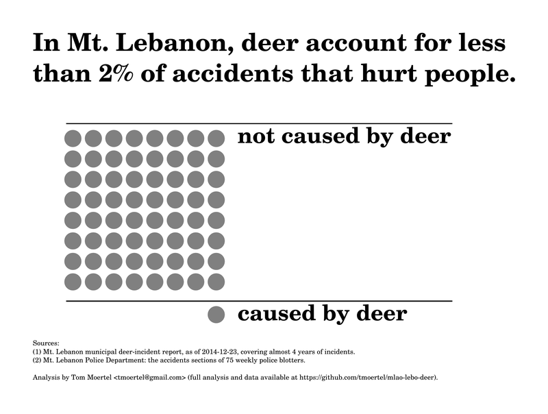

mlao-lebo-deer
==============

This repository holds data and analyses relating to deer in Mt. Lebanon, Pennsylvania.
It contains almost 4 years' data on deer incidents and about 75 weeks' data on car accidents.
I have made reasonable efforts to clean the data and convert it into easy-to-use CSV files.

How dangerous are deer?
-----------------------

*Note: The analysis below was last updated December 2014.*

In Mt. Lebanon, deer have been portrayed as a “major public safety issue.”
How dangerous are deer really?

According to municipal records, when it comes to people actually getting hurt, deer account for only about 1.5 reported incidents per year.

```R
> ## First, deer-related incidents.
> (deer_injury_incidents <- sum(deer_incidents$Person.Injured == "X"))
[1] 6
> (deer_incident_years <- diff(range(deer_incidents$date)) / dyears(1))
[1] 3.884932
> (deer_injury_incidents_per_year <- deer_injury_incidents / deer_incident_years)
[1] 1.544429
```

By comparison, cars account for about 100 reported incidents of people getting hurt per year, according to police accident reports.

```R
> ## Next, car-related incidents in general.
> (car_injury_incidents <- sum(car_accidents$injuries > 0))
[1] 147
> (car_incident_years <- police_blotter_data_coverage_in_years)
[1] 1.438356
> (car_injury_incidents_per_year <- car_injury_incidents / car_incident_years)
[1] 102.2
```

Put simply, for every incident in which people get hurt by deer, cars cause over 65 such incidents.

```R
> (relative_risk_of_injury_car_to_deer <-
+  car_injury_incidents_per_year / deer_injury_incidents_per_year)
[1] 66.17333
```

Therefore, if we are to believe that deer in Mt. Lebanon are a “major public safety issue,” we must also believe that cars – a risk that most people understand and are comfortable with – represents over 65 “major public safety issues” combined.

Another way to understand how small the purported “deer danger” actually is is to express it this way:
*In Mt. Lebanon, deer are involved in less than 2% of accidents in which people get hurt.*
In graphical form, the relationship looks like this:



If you're in an accident, are you more likely to be hurt if it involves a deer?
-------------------------------------------------------------------------------

No, quite the opposite is true.
According to Mt. Lebanon's accident and deer-incident records, if an accident involves a deer, the accident is much *less* likely than usual to injure someone: the risk is only 1/9th as great.
While 35% of all car accidents in Mt. Lebanon result in injury, only 3.8% of car accidents involving deer do.

This does make sense when you think about it.
If you're in a car accident, it's usually because your car collided with something else.
If that something else *wasn't* a deer, it was probably something much harder and much heavier – a car, a tree, or some roadside object made of steel or concrete.

```R
> ### If there's a car accident in Mt. Lebanon, how much more (or less) likely
> ### is it to injure someone, given that a deer was involved?
> frequency <- function(bools) sum(bools) / length(bools)
> (freq_of_injury_in_all_car_accidents <- frequency(car_accidents$injuries > 0))
[1] 0.35
> (freq_of_injury_in_deer_car_accidents <- frequency(deer_accidents$Person.Injured == "X"))
[1] 0.03821656
> (rel_freq_of_injury_in_accidents_if_deer_involved <-
+      (freq_of_injury_in_deer_car_accidents /
+           freq_of_injury_in_all_car_accidents))
[1] 0.1091902
```

Data sources
------------

Deer-incident data comes from the Mt. Lebanon municipal web site:
https://lebotools.mtlebanon.org/dit/public_incident_report.php
(Retrieved on 2014-12-23.)

Car-accident data comes from Mt. Lebanon Police Department weekly blotters,
as obtained from the Mt. Lebanon municipal and police department web sites.
http://mtlebanonpd.org/news/police-blotter/

Questions or comments?
----------------------

Please direct them to Tom Moertel at tmoertel@gmail.com.
